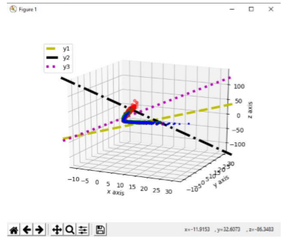

Implemantation of least mean squares algorithm in machine learning using python.

The labels are three based on the goals of each team (home team , away team).

If home team goals - away team goals > 0 then label is H (home win)

If home team goals - away team goals = 0 then label is D (draw)

If home team goals - away team goals < 0 then label is A (away win)

There are four betting companies {B365,BW,IW,LB} and the vector Ψκ have the betting odds for each company and each match possible outcome.

The goal is to find the accuracy of the companies (using least mean squares) after a 10 k fold validation and find the company with the best accuracy out of 4.

Database used: https://www.kaggle.com/hugomathien/soccer

SUMMARY OF LMS ALGORITHM

Input signal vector x(n)

Desired response d(n)

Parameter n

Initilization w(0) = 0

For n = 1,2,...

e(n) = d(n) - W^T(n) * x(n)

W(n+1) = W(n) + n * x(n) * e(n)

